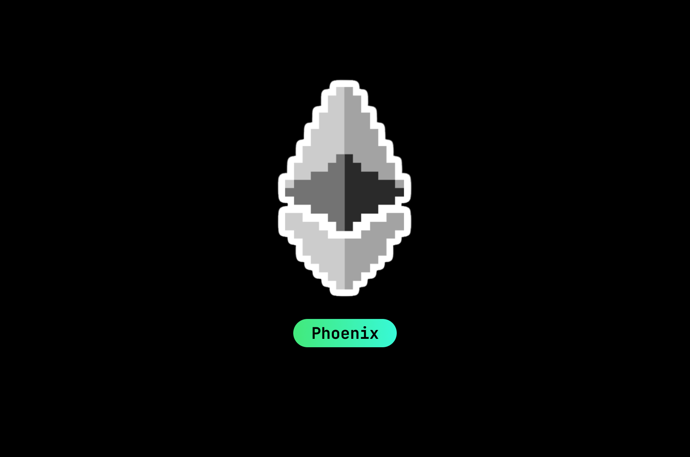

# Wave-Portal

## Project Link:
**The completed application can be viewed below:**

https://waveportal-starter-project.competencytestl.repl.co/

## Description:

This project is a simple implementation of blockchain technology via a decentralized wave-portal website with Solidity smart contract deployed to the Ethereum blockchain. The application will allow users to interact with the smart contract by sending a "wave" and message greeting. Users can see their message displayed on the webpage and are only required to connect to their crypto wallet on the Rinkeby testnet. Users also have a chance to win free ETH!

## Tech Stacks/ Resources Used:
- Solidity
    - [Solidity version 0.8.4](https://docs.soliditylang.org/en/v0.8.4/)
- JavaScript
    - [React.js](https://reactjs.org/)
- CSS
- HTML
- Other tools and resources
    - [Hardhat](https://hardhat.org/)
    - [Alchemy](https://www.alchemy.com/)
    - [Metamask](https://metamask.io/)
    - [Etherscan](https://etherscan.io/)

### My Project NFT

### Acknowledgements:
Special thanks to the following parties below for the assistance in completing this project.
1. [builspace](https://buildspace.so/) for the amazing content and NFT.
2. [Chainlink](https://faucets.chain.link/rinkeby) for their generosity providing test ETH faucet.

